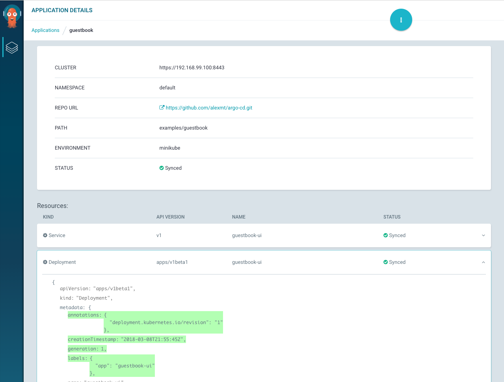

# Argo CD Getting Started

Guestbook app demonstrates how ArgoCD works, you can run examples of simple workflows and workflows that use artifacts.

## Requirements
* Installed [minikube](https://github.com/kubernetes/minikube#installation)
* Installed the [kubectl](https://kubernetes.io/docs/tasks/tools/install-kubectl/) command-line tool
* Have a [kubeconfig](https://kubernetes.io/docs/tasks/access-application-cluster/configure-access-multiple-clusters/) file (default location is `~/.kube/config`).

## 1. Download Argo CD

`TO BE ADDED`

## 2. Install the Argo CD components
```
$ argocd install
```

## 3. Open access to Argo CD API server and configure Argo CD CLI

By default Argo CD API server is not exposed with an external IP. To expose API server, change service type to `LoadBalancer` use the following command:

```
$ kubectl patch svc argocd-server -n argocd -p '{"spec": {"type": "LoadBalancer"}}'
```

Export API server URL into `ARGOCD_SERVER` environment variable using the following command":

```
$ export ARGOCD_SERVER=$(minikube service argocd-server -n argocd --url | cut -d'/' -f 3)
```

Now you Argo CD is able to talk to API server and you can deploy first application.

## 4. Connect and deploy Guestbook application

1. Register minicube cluster and github repository which contains Guestbook application:

```
$ argocd repo add https://github.com/argoproj/argo-cd.git
$ argocd cluster add minikube
```

2. Add Guestbook application:

```
$ argocd app add guestbook --repo https://github.com/argoproj/argo-cd.git --path examples/guestbook --env minikube
```

Once application is added you can see application status using following commands:

```
$ argocd app list
$ argocd app sync guestbook
```

The application status is `OutOfSync` and not Kubernetes resouces have been created since application is not deployed yet. To deploy application use following command:

```
$ argocd app sync guestbook
```

Argo CD allows to view and manager applications using web UI. Get the web UI URL using following command:

```
minikube service argocd-server -n argocd --url
```


